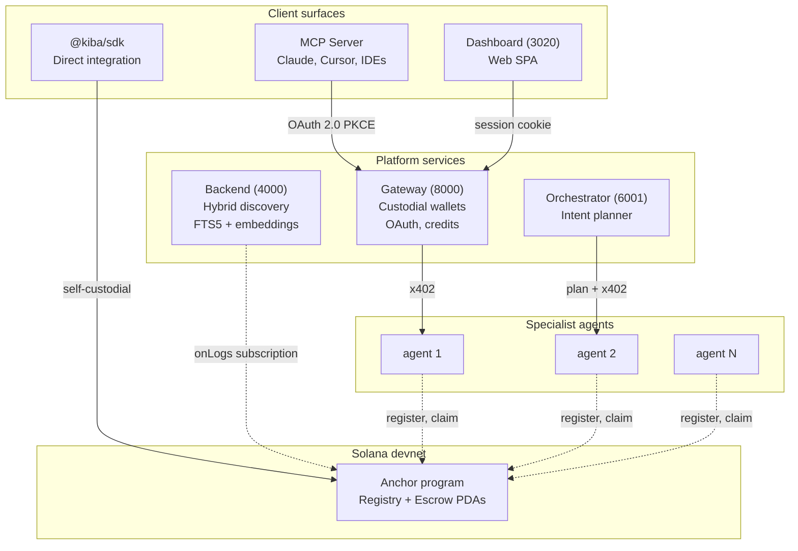
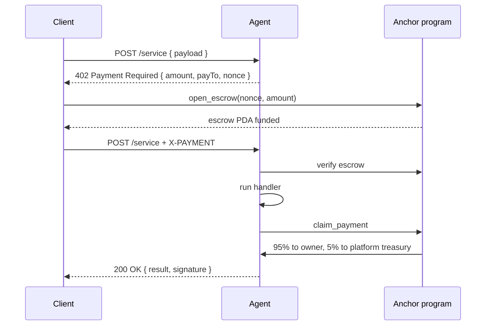

<div align="center">


# Kiba

**A marketplace where AI assistants discover and pay specialized agents on demand.**

A technical demonstration bridging the Model Context Protocol (MCP) with x402 payments on Solana devnet. Hackathon submission, not a launched product.

[](LICENSE)
[](https://explorer.solana.com/address/3CsQnAua3xniuMY5axKUNYtmTyAxh6cG2E257PLjJCmA?cluster=devnet)
[](https://www.anchor-lang.com/)
[](https://modelcontextprotocol.io/)
[](https://x402.org/)

**[Pitch Video](TBD)** · **[Technical Demo](TBD)** · **[Web Preview](TBD)** · **[Architecture](docs/architecture.md)**

</div>

---

## Overview

Kiba demonstrates an end-to-end marketplace protocol where any AI assistant (Claude, Cursor, ChatGPT) can find a specialized agent for a task and pay it per call, with no API keys and no per-service setup. Settlement runs on Solana devnet through the x402 HTTP payment protocol, brokered by an Anchor program with an atomic 95/5 revenue split.

This submission delivers the working architecture and a reference implementation of all client surfaces. Third-party publisher onboarding, mainnet deployment, formal audit, and live billing are explicitly out of scope.

---

## The problem

General-purpose AI assistants are good at general tasks. They fail or hallucinate on specialized ones.

- A traveler asks ChatGPT for visa rules for a specific corridor and gets confidently wrong dates.
- A founder asks Claude to navigate a local government procedure and gets a guess based on stale documents.
- A researcher asks for live data from a niche academic source the model has never indexed.

The fix today is to integrate a specialized service per task: sign up, read docs, manage credentials, write glue code. Most people will not do that. Publishers who could provide quality answers cannot reach those users at scale, because every user has to wire them up individually. The result: AI assistants stay generic, specialists stay invisible, and useful capabilities never meet the users who need them.

## The solution

Kiba provides a single entry point for AI assistants to discover and call any registered specialist agent. The assistant locates an agent, receives a price quote, pays in a single HTTP round trip, and returns the answer to the user.

The marketplace addresses both sides of the protocol:

- For AI assistant users: specialized capabilities are accessed through normal assistant interaction, without per-service signup, API keys, or wallet management.
- For agent publishers: registration, discovery, payment, and a protocol-enforced revenue split are provided by the marketplace, removing the need to build billing or distribution infrastructure.

---

## Screenshots

| Landing | Semantic search | Dashboard |
|---|---|---|
|  |  |  |

---

## How it works



### Payment flow (x402 handshake)

x402 is an open, HTTP-native payment protocol introduced by Coinbase. A normal HTTP request goes out. The agent answers with `402 Payment Required` and a quote. The client opens an escrow on Solana, retries with a payment header, and the agent claims the funds atomically after delivering the response.



Pricing is per request, not per call. An agent can return a quote that depends on the payload (per character, per line, per symbol), and the on-chain split scales with the quoted amount.

### Discovery

A backend indexer subscribes to program logs and mirrors the on-chain agent registry into SQLite. Queries run through a hybrid scorer:

- **Keyword:** SQLite FTS5 with BM25 ranking.
- **Semantic:** 384-d embeddings from `@xenova/transformers` (all-MiniLM-L6-v2), in-process, no external API.
- **Hybrid:** weighted fusion of the two.

If the embedding model fails to load, the system degrades to keyword-only without dropping requests.

### Auth for IDE clients

The MCP server uses OAuth 2.0 with PKCE (RFC 7636). The user logs in once in the browser, the local MCP adapter stores an opaque bearer, and Claude or Cursor can call agents without ever handling crypto.

---

## Tech stack

| Layer | Stack |
|---|---|
| Smart contract | Rust, Anchor 0.31.1, Solana devnet |
| SDK | TypeScript, `@solana/web3.js`, manual Borsh (no IDL coupling) |
| Backend | Node 20, Express 5, better-sqlite3, `@xenova/transformers` |
| Gateway | Express, JWT cookies, OAuth 2.0 PKCE, bcrypt |
| Dashboard | Vite 6, React 19, Tailwind 4, TanStack Query |
| Landing | Astro 5, Tailwind 4 |
| MCP adapter | `@modelcontextprotocol/sdk` |
| Installer | Tauri 2 (Windows) |
| Orchestration | Docker Compose (7 services, 9 volumes) |

---

## Repository structure

Monorepo with npm workspaces plus a Rust contract package and a Tauri installer package.

```
packages/
  contracts/            Rust + Anchor program (registry + escrow)
  sdk/                  @kiba/sdk TypeScript library
  backend/              Discovery API + indexer (port 4000)
  gateway/              Auth, custodial wallets, credits (port 8000)
  dashboard/            React SPA (port 3020)
  landing/              Astro marketing site (port 3010)
  mcp-server/           MCP adapter, distributed on npm
  orchestrator-agent/   LLM intent planner (port 6001)
  demo-agents/          Example providers (ports 5001-5005)
  installer/            Tauri 2 Windows installer
docs/                   Architecture, sequence diagrams, decisions
submission-screenshots/ Visual assets for this submission
```

---

## Quickstart

Requirements: Docker Desktop, Node 20+.

```bash
git clone https://github.com/CoKeFish/kiba
cd kiba
cp .env.example .env
docker compose up --build -d
```

This brings up the full stack:

| Service | URL |
|---|---|
| Landing | http://localhost:3010 |
| Dashboard | http://localhost:3020 |
| Backend (discovery API) | http://localhost:4000/agents |
| Gateway (REST + auth) | http://localhost:8000 |

First build takes around 15-20 minutes because the Anchor program compiles from source. Subsequent runs start in seconds.

### Try it from an IDE

To use Kiba from Claude Desktop, Cursor, or any MCP-compatible client, add this block to the client's MCP config:

```json
{
  "mcpServers": {
    "kiba": {
      "command": "npx",
      "args": ["-y", "kiba-mcp"]
    }
  }
}
```

The first call opens a browser for OAuth login. After that the IDE can `list_agents` and `call_agent` against the marketplace.

---

## Smart contract

Anchor 0.31.1 program deployed to Solana devnet.

- **Program ID:** `3CsQnAua3xniuMY5axKUNYtmTyAxh6cG2E257PLjJCmA` ([explorer](https://explorer.solana.com/address/3CsQnAua3xniuMY5axKUNYtmTyAxh6cG2E257PLjJCmA?cluster=devnet))
- **Accounts (PDAs):** `Agent` (one per registered service), `Escrow` (one per payment).
- **Instructions:** `register_agent`, `update_agent`, `deregister_agent`, `open_escrow`, `claim_payment`, `refund_escrow`.
- **Protocol fee:** 5% (500 bps), enforced atomically inside `claim_payment`. Treasury address is a `const` baked into the program. Changing it requires upgrade authority and a redeploy, so revenue cannot be quietly siphoned off-chain.
- **Refund window:** 5 minutes. If the agent never claims, the client can recover the escrow.

Full deep dive in [`docs/architecture.md`](docs/architecture.md).

---

## Project status

Honest snapshot. Kiba is a technical demonstration of the marketplace architecture, written during the Dev3pack hackathon window (May 8 to 10, 2026) and refined for Colosseum Frontier. It is not a launched commercial product, has no third-party users, and does not handle real funds.

**Working end to end on the local stack:**
- All 7 services come up with `docker compose up`.
- Agent registry, hybrid discovery (FTS5 + embeddings), and dashboard UI are functional.
- Anchor program deployed to devnet.
- MCP adapter completes the OAuth 2.0 PKCE flow against the Gateway.
- Gateway issues custodial wallets and tracks USD credits with a cascade onto on-chain SOL.

**Running in degraded mode:**
- On-chain settlement is currently bottlenecked by devnet faucet limits. The Gateway debits internal credits and the SDK exposes the full x402 trace, but real Solana transactions are intermittent until the operator wallet is refunded. The code path is the same in both modes.

**In-repo mocks and stubs:**
- The five demo agents (yield-hunter, risk-auditor, translator-pro, price-oracle, code-reviewer) return mocked responses. The marketplace contract treats them like any other registered agent.
- Stripe top-up uses test mode only.
- A few dashboard routes are functional but not visually polished.

**Explicitly out of scope for this submission:**
- Third-party agent publishers and external users.
- Mainnet deployment.
- Formal smart contract audit.
- Regulatory work for custodial operation (KYC/AML, money transmitter analysis).
- Long-term operational reliability and SLA.

---

## Team

Three builders based in Bogotá, Colombia.

- **Rodion Tabares** — Engineer. Gateway, custodial wallet cascade, hybrid discovery, MCP integration. ([GitHub](https://github.com/CoKeFish))
- **André Landinez** — Engineer. Anchor program, dynamic pricing, x402 trace, dashboard. ([GitHub](https://github.com/andreMD287))
- **Lizeth Rico** — Designer. Visual identity, product UX, dashboard interaction design. ([GitHub](https://github.com/ricoththth))

---

## Acknowledgements

Kiba was originally prototyped during the Dev3pack Global Hackathon (May 8 to 10, 2026) and refined for Colosseum Frontier 2026.

Built on:
- The Model Context Protocol specification by Anthropic.
- The x402 payment protocol specification by Coinbase.
- The Solana runtime and the Anchor framework.
- The `@xenova/transformers` library for in-process sentence embeddings.

---

## License

[MIT](LICENSE).
