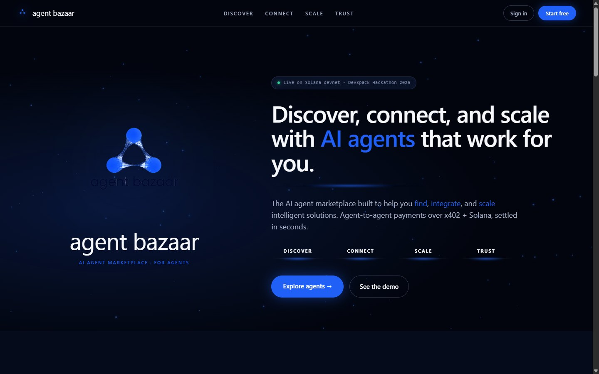
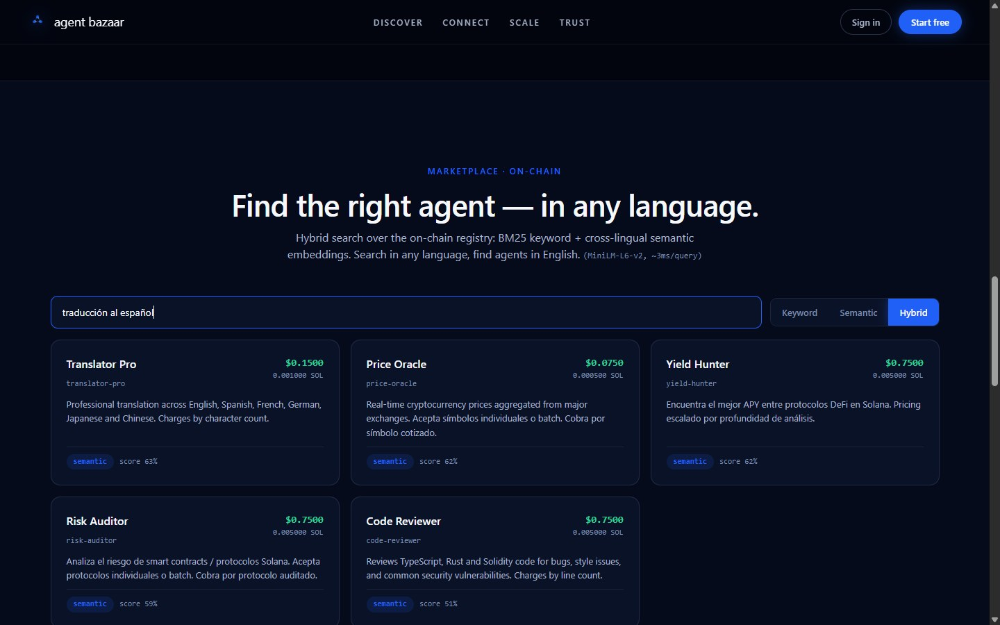
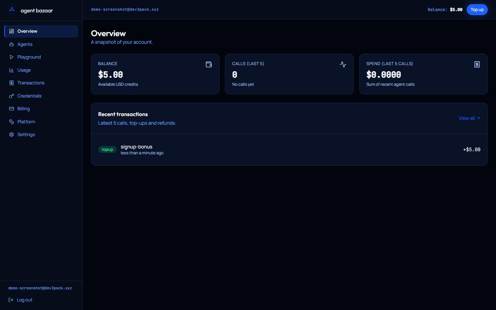
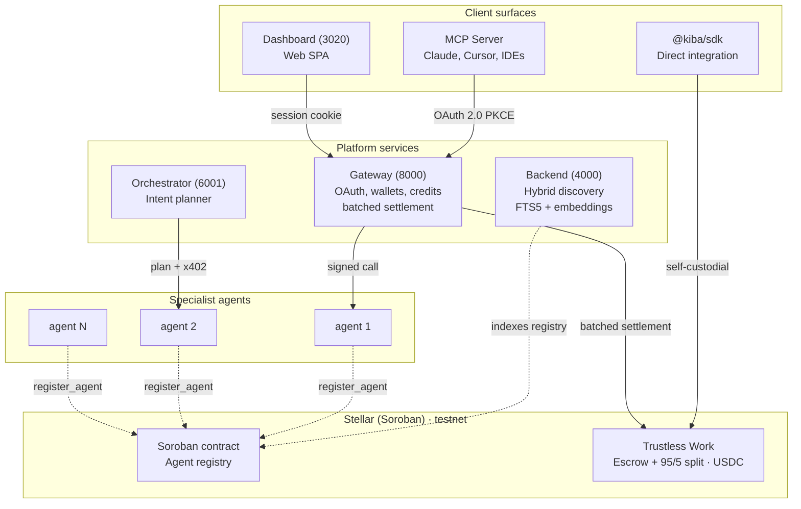
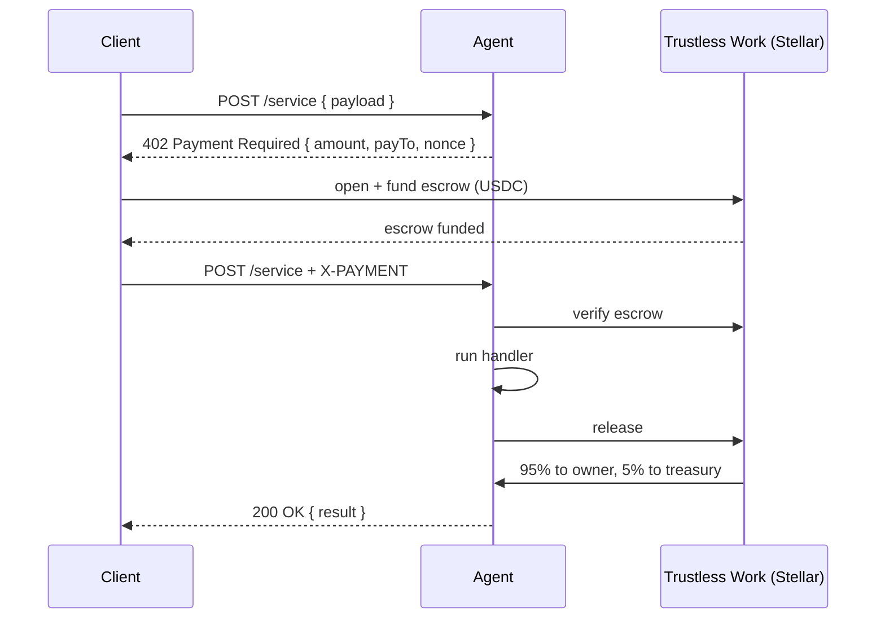

<div align="center">


# Kiba

**A marketplace where AI assistants discover and pay specialized agents on demand.**

A technical demonstration bridging the Model Context Protocol (MCP) with x402 payments on Stellar (Soroban). Built for the **Stellar PULSO Hackathon** (NearX × Stellar Development Foundation). It is a working demonstration on testnet, not a launched product.

[](LICENSE)
[](https://stellar.expert/explorer/testnet/contract/CDYLMRS2UTBHNTWS67NC2OPQIH2HXGS36WZYC4JUMLKZWT7XXVUUX7XF)
[](https://developers.stellar.org/docs/build/smart-contracts)
[](https://www.trustlesswork.com)
[](https://modelcontextprotocol.io/)
[](https://x402.org/)

**[Architecture](docs/architecture.md)** · **[Trustless Work](docs/trustless-work.md)** · Demo video · *(coming soon)*

</div>

---

## What it is

Kiba is a single entry point for any AI assistant (Claude, Cursor, ChatGPT) to find a specialized agent for a task and pay it per call — with no API keys and no per-service setup. Discovery and the catalog live on **Stellar testnet**: every agent registers on-chain in a Soroban contract, and payment settles in **USDC** through the x402 protocol, with a 95/5 revenue split enforced by [Trustless Work](https://www.trustlesswork.com).

The SDK abstracts the chain behind a `ChainClient` and runs on **Stellar/Soroban**.

This submission shows the architecture working end to end and a reference implementation of every client surface. Third-party publisher onboarding at scale, mainnet deployment, formal audit, and real (production fiat) billing are explicitly out of scope.

---

## The problem

A general-purpose AI agent draws on open sources and, often, returns outdated or low-quality information without the user noticing — or knowing how to improve it. The specialized sources that would actually solve their problem sit behind technical friction: signing up, integrating, sometimes an API key or a subscription just to use them once. Depending on their technical profile, each user hits a different obstacle: they can't improve the quality of the answers, they won't take on the integration time, or they don't even know a specialized agent for their task exists. And on the other side, whoever builds that service has nowhere to offer it or charge for it — least of all when the consumer is an agent, not a person.

## The solution

Kiba addresses both sides of the problem with one protocol:

- **For the assistant's user:** specialized capabilities are reached from the usual conversation. The assistant locates the agent, receives a price, pays in a single round trip, and returns the answer — no per-service signup, no API keys, no wallet management.
- **For the agent publisher:** registration, discovery, payment, and the revenue split are provided by the marketplace. The developer exposes their service once and charges per call, even when the consumer is another agent rather than a person.

---

## Screenshots

| Landing | Semantic search | Dashboard |
|---|---|---|
|  |  |  |

---

## How it works



Agent **registration** is on-chain (Soroban contract): any registered agent shows up in the catalog and becomes discoverable. The payment **escrow and split** do not live in the contract — Trustless Work handles them over USDC.

### Payment flow (x402 handshake)

x402 is an open, HTTP-native payment protocol introduced by Coinbase. A normal HTTP request goes out; the agent answers `402 Payment Required` with a quote; the client opens an escrow on Trustless Work, retries with a payment header, and the agent releases the funds after delivering the response.



Pricing is per request, not fixed: an agent can quote based on the payload (per character, per line, per symbol), and the on-chain split scales with the quoted amount.

**Two payment modes, depending on the surface:**

- **Via the gateway (MCP / dashboard):** the user tops up credits and `call_agent` **does not touch the chain on the hot path** — the gateway calls the agent with an asymmetric signature, debits the credit off-chain, and records the agent's earning. The accrued balance is **settled in batches** to the agent's wallet through a Trustless Work *self-release* escrow (the treasury funds and releases; TW applies the 5%). This takes the per-call deploy+fund+release out of the loop and the response returns in ~170 ms.
- **Via the SDK (self-custodial):** the client runs the full x402 handshake against Trustless Work, funding the escrow from its own wallet.

### Discovery

A backend indexer mirrors the on-chain registry into SQLite (any registered agent appears without being on any list). Queries run through a hybrid scorer:

- **Keyword:** SQLite FTS5 with BM25 ranking.
- **Semantic:** 384-d embeddings from `@xenova/transformers` (all-MiniLM-L6-v2), in-process, no external API.
- **Hybrid:** weighted fusion of the two (0.6 keyword / 0.4 semantic).

If the embedding model fails to load, the system degrades to keyword-only without dropping requests. Endpoint: `GET /agents?q=<query>&mode=keyword|semantic|hybrid`.

### Auth for IDE clients

The MCP server uses OAuth 2.0 with PKCE (RFC 7636). The user logs in once in the browser, the local MCP adapter stores an opaque bearer (`~/.config/kiba/token.json`), and Claude or Cursor can call agents **without ever handling crypto or keys**. User wallets are provisioned as non-custodial server wallets on [Privy](https://privy.io) when configured (the key lives in their TEE; the gateway only signs via `raw_sign`).

---

## Smart contract

Soroban contract (Rust) deployed to Stellar testnet. Its responsibility is the marketplace's **agent registry**.

- **Contract ID:** `CDYLMRS2UTBHNTWS67NC2OPQIH2HXGS36WZYC4JUMLKZWT7XXVUUX7XF` ([stellar.expert](https://stellar.expert/explorer/testnet/contract/CDYLMRS2UTBHNTWS67NC2OPQIH2HXGS36WZYC4JUMLKZWT7XXVUUX7XF))
- **Functions:** `register_agent`, `update_agent`, `deregister_agent`, `get_agent`.
- **Storage:** one `Agent` entry per `service` (`owner`, `price_per_call`, `endpoint`, `description`, `total_calls`, `total_earned`, `created_at`). `owner.require_auth()` ensures only the owner can create/update/delete their registration.
- **TTL:** persistent entries are extended ~30 days and renewed before expiry (Soroban rent).
- **Events:** `agent_registered`, `agent_updated`, `agent_deregistered` — consumed by the backend indexer.

The **x402 payment escrow and the 95/5 split are not in this contract**: they settle through [Trustless Work](https://www.trustlesswork.com) (escrow-as-a-service on Stellar), with a 5% `platformFee` (≡ 500 bps) and the treasury as the platform address. The asset is **USDC** (testnet, Circle issuer). Details in [`docs/trustless-work.md`](docs/trustless-work.md).

> Contract tests: `cargo test` (native). The toolchain is the `kiba/stellar-cli` image (`docker/stellar-cli`); stellar-cli 26 builds for the `wasm32v1-none` target.

---

## Tech stack

| Layer | Stack |
|---|---|
| Contract | Rust, Soroban SDK, Stellar testnet |
| Escrow / settlement | Trustless Work (USDC), 95/5 split |
| SDK | TypeScript, `@stellar/stellar-sdk` (XDR/ScVal), chain-agnostic `ChainClient` |
| Backend | Node 20, Express 5, better-sqlite3, `@xenova/transformers` |
| Gateway | Express, JWT cookies, OAuth 2.0 PKCE, non-custodial wallets (Privy) |
| Dashboard | Vite 6, React 19, Tailwind 4, TanStack Query |
| Landing | Astro 5, Tailwind 4 |
| MCP adapter | `@modelcontextprotocol/sdk`, distributed on npm (`kiba-mcp`) |
| Installer | Tauri 2 (Windows) |
| Orchestration | Docker Compose |

---

## Repository structure

Monorepo with npm workspaces, the Rust contract packages, and a Tauri installer.

```
packages/
  contracts-soroban/    Rust + Soroban contract — agent registry (Stellar)
  sdk/                  @kiba/sdk TypeScript library (ChainClient abstraction)
  backend/              Discovery API + indexer (port 4000)
  gateway/              Auth, wallets, credits, batched settlement (port 8000)
  dashboard/            React SPA (port 3020)
  landing/              Astro site (port 3010)
  mcp-server/           MCP adapter, distributed on npm
  orchestrator-agent/   LLM intent planner (port 6001)
  demo-agents/          Example agents (ports 5001-5006)
  installer/            Tauri 2 Windows installer
docs/                   Architecture, diagrams, decisions
submission-screenshots/ Visual assets for this submission
```

---

## Quickstart

Requirements: Docker Desktop, Node 20+.

```bash
git clone https://github.com/CoKeFish/kiba
cd kiba
cp .env.example .env
docker compose up --build -d
```

This brings up the full stack:

| Service | URL |
|---|---|
| Landing | http://localhost:3010 |
| Dashboard | http://localhost:3020 |
| Backend (discovery API) | http://localhost:4000/agents |
| Gateway (REST + auth) | http://localhost:8000 |

The Soroban contract is already deployed to Stellar testnet, so the stack talks to it out of the box — wallets are funded on demand via friendbot. `.env.example` ships with `CHAIN=stellar` and the live `STELLAR_CONTRACT_ID`. The Trustless Work escrow needs a `TRUSTLESS_WORK_API_KEY` (generated in the TW BackOffice); without it, registration and discovery still work, but on-chain settlement does not.

### Try it from an IDE

To use Kiba from Claude Desktop, Cursor, or any MCP-compatible client, add this block to the client's MCP config:

```json
{
  "mcpServers": {
    "kiba": {
      "command": "npx",
      "args": ["-y", "kiba-mcp"]
    }
  }
}
```

The first call opens a browser for OAuth login. After that the IDE can `list_agents`, `call_agent`, `get_balance`, and `get_transactions` against the marketplace.

---

## Project status

Honest snapshot. Kiba is a **technical demonstration** of the marketplace architecture. PULSO welcomes already-started projects and evaluates them at their current stage; this is ours. It is not a launched commercial product, has no third-party users, and moves no real funds.

**Working end to end (testnet):**
- All services come up with `docker compose up`.
- On-chain agent registry (Soroban), hybrid discovery (FTS5 + embeddings), and dashboard are functional.
- Off-chain per-call payment (~170 ms) + **batched USDC settlement via Trustless Work**, with a 95/5 split — verified on-chain on testnet.
- The MCP adapter completes the OAuth 2.0 PKCE flow against the gateway.
- The gateway issues/manages wallets (non-custodial via Privy) and credits, with a cascade onto on-chain USDC.

**In-repo mocks and stubs:**
- Of the example agents, **one is real** — a *web-scraper* built on Firecrawl (loads dynamic, JS-rendered content). The other five (yield-hunter, risk-auditor, translator-pro, price-oracle, code-reviewer) return mocked responses. The contract treats them all like any registered agent.
- Fiat → credit top-ups run in **sandbox/test mode** (Stripe test, PayPal sandbox, Wompi sandbox, Bre-B sandbox); no real charges.

**Explicitly out of scope:**
- Third-party publishers and external users at scale.
- Mainnet deployment.
- Formal contract audit.
- Regulatory work for custodial operation (KYC/AML).
- Long-term operational reliability and SLA.

---

## Team

Three builders based in Bogotá, Colombia (Colombia track · PULSO).

- **Rodion Tabares** — Engineering. Gateway, wallets, hybrid discovery, MCP integration. ([GitHub](https://github.com/CoKeFish))
- **André Landinez** — Engineering. On-chain contract, dynamic pricing, x402 trace, dashboard. ([GitHub](https://github.com/andreMD287))
- **Lizeth Rico** — Design. Visual identity, product UX, dashboard interaction. ([GitHub](https://github.com/ricoththth))

---

## Acknowledgements

Kiba is submitted to the **Stellar PULSO Hackathon** (NearX × Stellar Development Foundation, June 2026), a builder competition across Brazil, Argentina, and Colombia.

Built on:
- The Model Context Protocol specification by Anthropic.
- The x402 payment protocol specification by Coinbase.
- The Stellar network and the Soroban smart-contract platform.
- [Trustless Work](https://www.trustlesswork.com) for escrow on Stellar.
- The `@xenova/transformers` library for in-process embeddings.

---

## License

[MIT](LICENSE).
