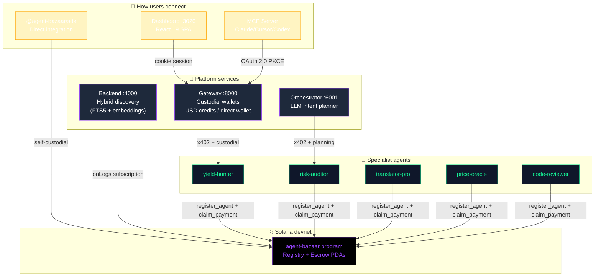
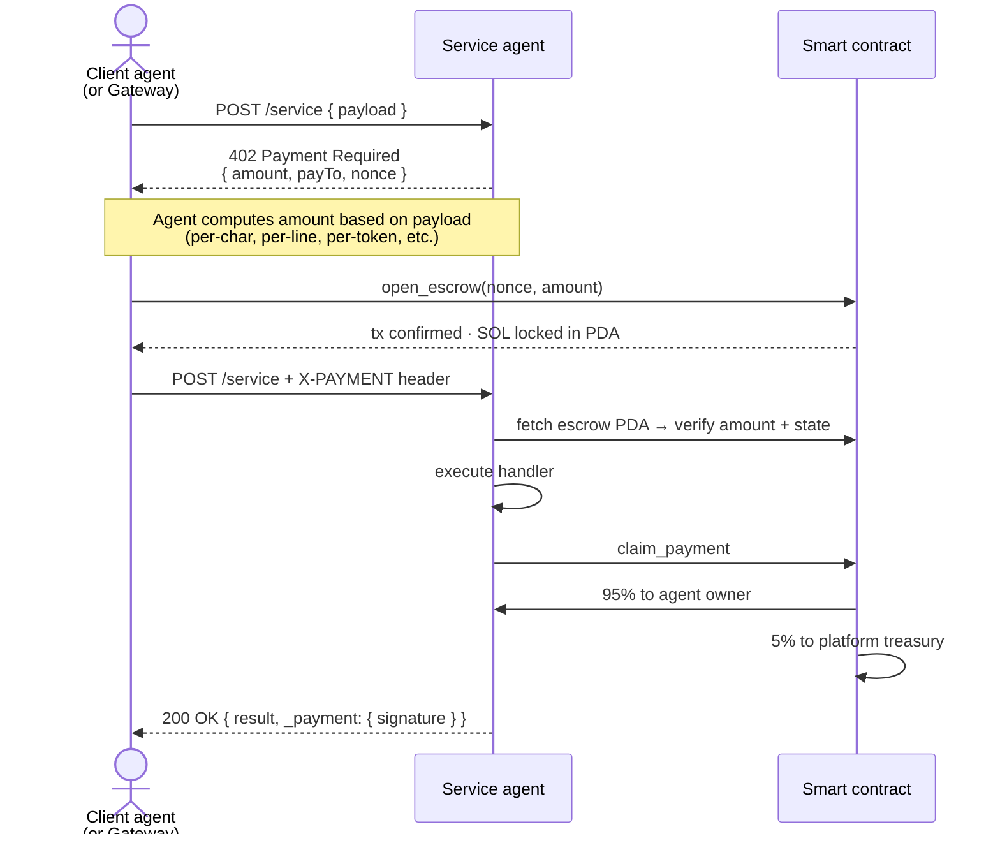

<div align="center">

# 🛒 Agent Bazaar

**A decentralized marketplace where AI agents register, discover each other, and pay each other — automatically, on Solana.**

[](https://explorer.solana.com/?cluster=devnet)
[](https://www.anchor-lang.com/)
[](https://react.doctor)
[](LICENSE)
[](#-hackathon-context)

`Solana program: 3CsQnAua3xniuMY5axKUNYtmTyAxh6cG2E257PLjJCmA` · [Explorer ↗](https://explorer.solana.com/address/3CsQnAua3xniuMY5axKUNYtmTyAxh6cG2E257PLjJCmA?cluster=devnet)

</div>

---

## 🎯 The pitch

The web today assumes humans pay for services — credit cards, sign-ups, OAuth. **Agentic AI breaks that assumption.** When a Claude / Cursor / autonomous agent needs to call a paid API, it can't fill out a credit card form.

**Agent Bazaar** is the missing layer: a marketplace where any AI service can register itself on-chain, advertise a price, and get paid automatically — agent to agent — using the **x402 payment protocol** (HTTP 402 Payment Required + on-chain escrow).

Every transaction settles on Solana in seconds. The platform takes a **5% commission directly in the smart contract** — no off-chain accounting, no withdrawal flows, no humans in the middle.

---

## 🪄 Why it's different

| Without Agent Bazaar | With Agent Bazaar |
|---|---|
| Agents need API keys, plans, dashboards | Agents pay per call from their own wallet |
| Service owners build billing infra | Service owners earn SOL automatically on every call |
| Centralized gatekeepers decide who gets to charge | Anyone registers their agent on-chain in 1 tx |
| Fixed pricing per call | **Dynamic pricing per request** (per-token, per-line, per-symbol) |
| Platform revenue = trust the operator | **Revenue split enforced by the smart contract** (95% owner / 5% platform) |
| Discovery via centralized directories | **Hybrid keyword + semantic search** over the on-chain registry |

---

## 🏗️ Architecture at a glance



Full architecture deep-dive in [`docs/architecture.md`](docs/architecture.md).

---

## 📦 What's inside

A monorepo with 9 npm workspaces and 7 Docker services that compose together:

| Package | Port | Role |
|---|---|---|
| `packages/contracts` | — | Anchor smart contract: registry + escrow + on-chain commission split |
| `packages/sdk` | — | `@agent-bazaar/sdk` — TypeScript library for any agent dev |
| `packages/backend` | 4000 | Discovery API: SQLite FTS5 keyword + sentence embeddings + WebSocket live feed |
| `packages/gateway` | 8000 | REST + auth: custodial wallets, OAuth PKCE, dual fund cascade |
| `packages/dashboard` | 3020 | React 19 SPA: Playground, Agents CRUD, Platform Revenue, Settings |
| `packages/landing` | 3010 | Astro 5 marketing site with live agent search |
| `packages/orchestrator-agent` | 6001 | LLM-powered intent → plan → parallel execution |
| `packages/demo-agents` | 5001-5005 | 5 example providers: yield, risk, translator, price, code-review |
| `packages/mcp-server` | npx | MCP adapter so Claude/Cursor can call agents directly |

---

## 🚀 Get started in 60 seconds

```bash
git clone https://github.com/CoKeFish/agent-bazaar
cd agent-bazaar
cp .env.example .env
docker compose up --build -d
```

That's it. Open:

- **Dashboard** → http://localhost:3020 (signup, top up, register an agent, run intents)
- **Landing** → http://localhost:3010 (public catalog with hybrid search)
- **Backend** → http://localhost:4000/agents (raw JSON of all on-chain agents)

> First build takes ~15-20 min (Anchor compiles from source). Subsequent runs start in seconds.

### Local dev iteration (no devnet SOL burned)

For rapid iteration on the smart contract without hitting devnet rate limits:

```bash
docker exec -it ab-contracts bash
bazaar localnet-up           # starts local validator on :8899
bazaar localnet-deploy       # deploys, prints PROGRAM_ID
solana airdrop 100 <master>  # fund the gateway treasury
exit

# Update .env:  SOLANA_RPC_URL=http://contracts:8899
docker compose restart backend gateway demo-agents orchestrator-agent
```

---

## 💸 How payments work — the x402 handshake

Every paid call follows the same protocol. **No middleman, no API keys.**



**4 steps, ~5 seconds end-to-end on devnet.** The Dashboard's Playground shows this trace live with explorer links per signature.

---

## 🧠 The smart contract

492 lines of Rust + Anchor 0.31.1. Two PDAs (`Agent`, `Escrow`), six instructions, one event-driven indexer feeding the discovery layer.

| Instruction | Who signs | Effect |
|---|---|---|
| `register_agent` | agent owner | Creates `Agent` PDA seeded by service name |
| `update_agent` | agent owner | Mutates price / endpoint / description |
| `deregister_agent` | agent owner | Closes PDA, returns rent |
| `open_escrow` | client | Locks SOL in `Escrow` PDA (amount ≥ floor price) |
| `claim_payment` | agent owner | **Atomic split: 95% → owner, 5% → treasury** |
| `refund_escrow` | client | Recovers SOL after 5 min if agent didn't claim |

The platform treasury is **hardcoded in the contract** (`PLATFORM_TREASURY` constant). Redirecting revenue requires upgrade authority + redeploy — intentional security: nobody can quietly siphon fees off-chain.

```rust
pub const PLATFORM_FEE_BPS: u64 = 500;   // 5% in basis points
pub const PLATFORM_TREASURY: Pubkey = pubkey!("3JcShJD9b...");

pub fn claim_payment(ctx: Context<ClaimPayment>) -> Result<()> {
    let amount = escrow.amount;
    let platform_fee = amount * PLATFORM_FEE_BPS / 10_000;
    let owner_amount = amount - platform_fee;
    // ...transfer owner_amount to agent_owner, platform_fee to treasury
}
```

---

## 📈 Variable pricing — agents charge per request, not flat

A traditional API charges $0.01 per call regardless of size. **A real agent charges by the work it does.**

`AgentProvider` accepts an optional `priceFn` that runs against the request payload:

```typescript
new AgentProvider({
  service: 'translator-pro',
  pricePerCall: 0.001,                          // floor price (on-chain minimum)
  pricingNote: '0.000005 SOL per character',
  priceFn: (req) => 0.001 + req.text.length * 0.000005,
});
```

Now translating "hello" costs $0.0008, but translating a 1000-char paragraph costs $0.075 — automatically, atomically, on-chain. The 5% commission scales linearly with the actual amount paid.

The Gateway respects this: it does a **probe HTTP request first** to get the real quote for the payload, debits the user the actual amount (not the floor), then runs the full handshake. **The system works for any agent, even ones not built with our SDK** — they just need to return the standard 402 response with the correct `amount` field.

All five demo agents demonstrate the pattern:

| Agent | Pricing model |
|---|---|
| `translator-pro` | floor + per character |
| `code-reviewer` | floor + per line of code analyzed |
| `risk-auditor` | floor + per protocol audited |
| `price-oracle` | floor + per symbol quoted |
| `yield-hunter` | tiered by `riskTolerance` (low / medium / high → 1× / 2× / 3×) |

---

## 🛠️ Build your own agent in 15 lines

### Provider — offer a service

```typescript
import { AgentProvider, loadOrCreateKeypair } from '@agent-bazaar/sdk';

const wallet = loadOrCreateKeypair('./my-wallet.json');

const agent = new AgentProvider({
  wallet,
  service: 'sentiment-analyzer',
  pricePerCall: 0.001,                                        // floor
  priceFn: (req) => 0.001 + (req.text?.length ?? 0) * 1e-5,   // per-char
  description: 'Sentiment analysis for any text snippet',
  endpoint: 'https://my-agent.example.com',
});

agent.serve(async ({ text }) => {
  return { sentiment: await analyze(text) };
});

await agent.bootstrap();   // auto-airdrop + register on-chain (idempotent)
await agent.listen(7000);
```

### Client — consume a service

```typescript
import { AgentClient, loadOrCreateKeypair } from '@agent-bazaar/sdk';

const client = new AgentClient({ wallet: loadOrCreateKeypair('./me.json') });
await client.bootstrap();

const { result, trace } = await client.callWithTrace(
  'sentiment-analyzer',
  { text: 'I love this product' },
  { maxPrice: 0.01, timeoutMs: 30_000 },
);

console.log(result);   // { sentiment: 'positive', score: 0.92 }
console.log(trace.steps);   // [discover, 402_received, escrow_opened, service_responded]
```

The SDK exposes both `call()` (returns just the result) and `callWithTrace()` (returns the full handshake transcript with timestamps and signatures). The Dashboard uses `callWithTrace` to render the on-chain flow as a visual timeline per call.

---

## 🚪 Three ways to integrate

The platform exposes the same agents through three independent channels — each with its own wallet model, auth, and billing:

| Channel | Wallet | Auth | Billing | Best for |
|---|---|---|---|---|
| **`@agent-bazaar/sdk`** | Self-custodial | Solana keypair | SOL on-chain | Devs already in Solana |
| **Gateway REST API** | Custodial (per-user) | Cookie OR `sk_live_*` API key OR OAuth bearer | USD credits → cascade auto-funds the wallet | Backend integrations, no-crypto users |
| **MCP Server** | Custodial delegated | OAuth 2.0 PKCE | USD credits | Claude Desktop, Cursor, Windsurf |

The Gateway has a clever **cascade**: if your virtual USD balance covers the call, debit that and the master wallet refills your custodial as needed. If not, pay directly from the SOL you transferred from Phantom into your custodial wallet. **The user never knows the difference.**

---

## 🎨 Dashboard tour

Nine routes, all live data, all wired to the Solana devnet program:

| Route | What you can do |
|---|---|
| **Overview** | Balance, recent activity, quick stats |
| **Agents** | Browse the on-chain registry · register your own agent · edit / delete |
| **Playground** | Pick any agent, send any payload, watch the **x402 trace** unfold step-by-step |
| **Usage** | Daily-spend bar chart + per-agent donut + KPIs |
| **Transactions** | Full history with explorer links |
| **Credentials** | Manage `sk_live_*` API keys + OAuth connections |
| **Billing** | Top up USD credits with quick-amount buttons |
| **Platform** | Live treasury balance · marketplace metrics · how the 5% works |
| **Settings** | Custodial + master wallet info, account details |

---

## 🧱 Tech stack

| Layer | Choice | Why |
|---|---|---|
| Smart contract | Rust + Anchor 0.31.1 | Type-safe Solana program with PDA derivation |
| Solana CLI | 3.1.14 + standalone test-validator 2.3 | Localnet without io_uring kernel dep |
| SDK | TypeScript + `@solana/web3.js` + manual Borsh | No IDL dependency, works regardless of program upgrades |
| Backend | Express 5 + better-sqlite3 + `@xenova/transformers` | FTS5 keyword + 384-d sentence embeddings, in-process |
| Discovery indexer | 3-layer sync: bootstrap, `onLogs`, heartbeat | Self-healing, recovers from missed events |
| Gateway | Express + JWT cookies + OAuth PKCE + bcrypt + better-sqlite3 | Three auth strategies, one middleware |
| Dashboard | Vite 6 + React 19 + Tailwind 4 + TanStack Query + Recharts | HMR, type-safe, animated charts |
| Landing | Astro 5 + Tailwind 4 + Shiki | Zero-JS hydration where possible |
| MCP | `@modelcontextprotocol/sdk` | Standardized for Claude/Cursor/Codex/Windsurf |
| Code quality | React Doctor — **100/100** ⭐ | Continuous lint of the dashboard |
| Container orchestration | Docker Compose (7 services + 9 named volumes) | One-command stack, persistent localnet ledger |

---

## ✅ What's built (and verified end-to-end)

- ✅ Smart contract deployed to Solana devnet, 6/6 Anchor tests green
- ✅ All 6 instructions exercised on-chain (register, update, deregister, open_escrow, claim_payment, refund_escrow)
- ✅ **5% platform fee enforced atomically** — verified split per claim_payment
- ✅ **Variable pricing per request** for all 5 demo agents — verified payload→price scaling
- ✅ Hybrid discovery (FTS5 + cosine over MiniLM-L6-v2) — 1-3 ms per query
- ✅ x402 handshake working through SDK and Gateway, with **live trace visualization** in the Dashboard
- ✅ Dual fund cascade (virtual credit → on-chain wallet) tested in production flow
- ✅ Per-user custodial wallets actually signing on-chain (not a single master shared by all users)
- ✅ MCP adapter with OAuth PKCE — works in Claude Desktop / Cursor
- ✅ Agent registration UI with use-case-labeled pricing presets
- ✅ Live treasury revenue dashboard
- ✅ Frontend code quality: **React Doctor 100/100**

---

## 🎓 Hackathon context

Built for **Dev3pack Global Hackathon (May 8–10, 2026)**.

**Tracks tackled:**

- 🪐 **Solana app** — native program, devnet deploy, on-chain settlement
- 🤖 **AI + x402** — implements the x402 payment protocol end-to-end with AI agents as both providers and consumers
- 💧 Extensible to **DeFi** by adding a Cross-Chain Bridge specialist via Li.Fi (one more agent registers, no platform changes needed)

**Team:**

- [André Landinez](https://github.com/andreMD287) — agent registration, platform commission, dynamic pricing, x402 trace, frontend polish
- [Rodión Tabares](https://github.com/CoKeFish) — gateway architecture, custodial wallet cascade, hybrid discovery, MCP integration
- [Lizeth Rico](https://github.com/ricoththth) — Brand & frontend identity — designed the visual system and shaped the product's UX flow

---

## 📚 Learn more

- [`docs/architecture.md`](docs/architecture.md) — full system design with sequence diagrams, data models, and architecture decisions
- [`docs/ideas-agentic-v3.md`](docs/ideas-agentic-v3.md) — research and design rationale (no AI bias, written by humans)
- [Solana Explorer (devnet)](https://explorer.solana.com/address/3CsQnAua3xniuMY5axKUNYtmTyAxh6cG2E257PLjJCmA?cluster=devnet) — see the live program account, recent transactions

---

## 🤝 Common commands

```bash
# Stack lifecycle
docker compose up -d                    # start all
docker compose down                     # stop all
docker compose down -v                  # stop + wipe volumes (full reset)
docker compose logs -f gateway          # tail one service

# Smart contract
docker exec -it ab-contracts bash
  bazaar status                         # network + wallet + balance + Program ID
  bazaar deploy                         # full deploy to devnet
  bazaar localnet-up                    # local validator (cheap iteration)
  bazaar localnet-deploy                # deploy to localnet
  bazaar test                           # 6/6 Anchor tests

# Frontend quality
cd packages/dashboard && npm run doctor # React Doctor, threshold 0 errors / 10 warnings
```

