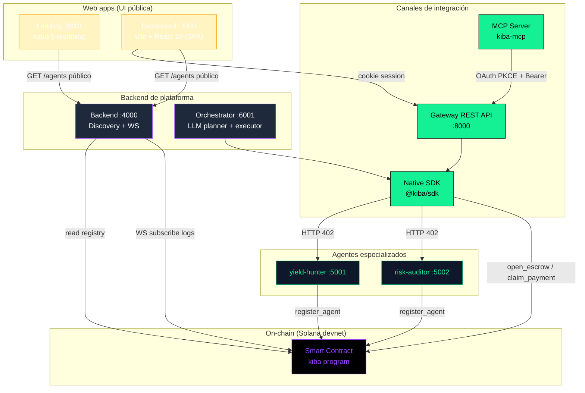
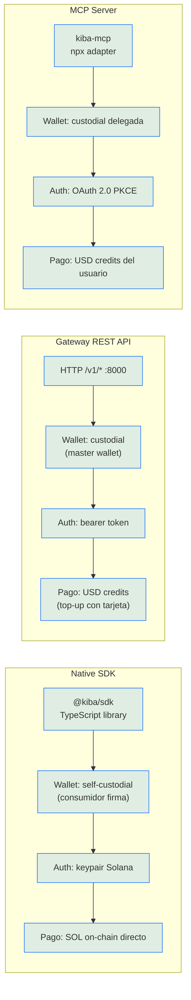
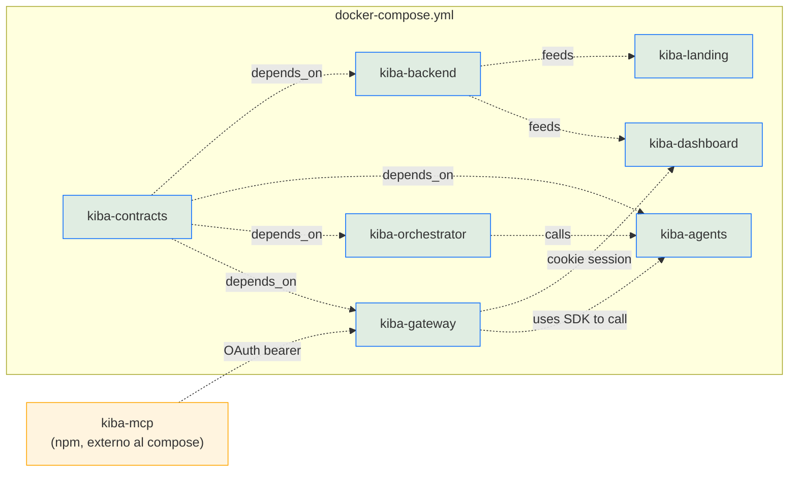
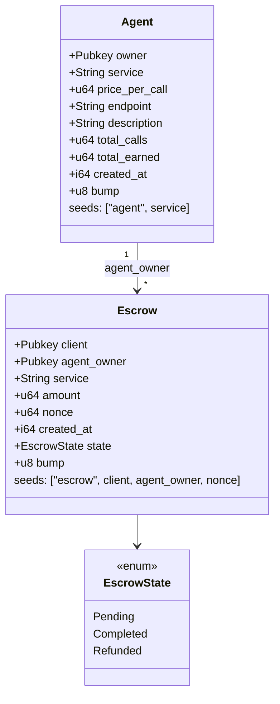
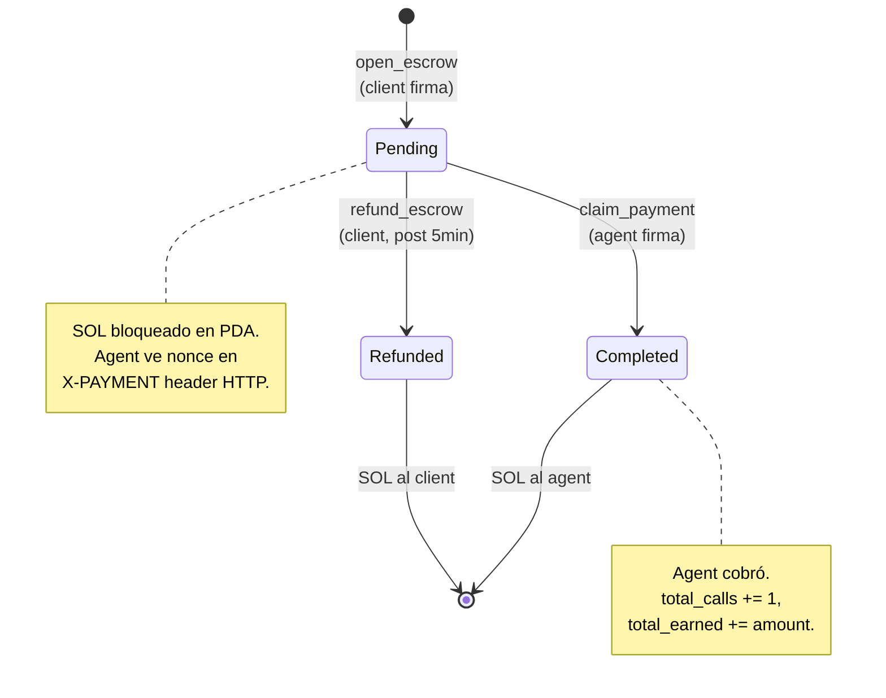
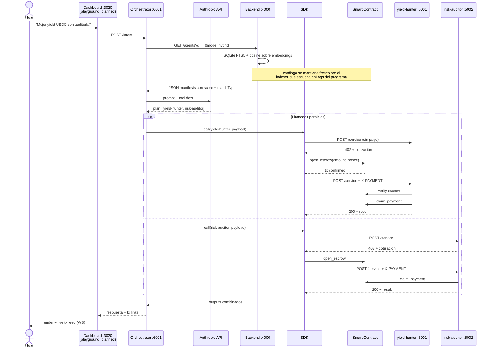
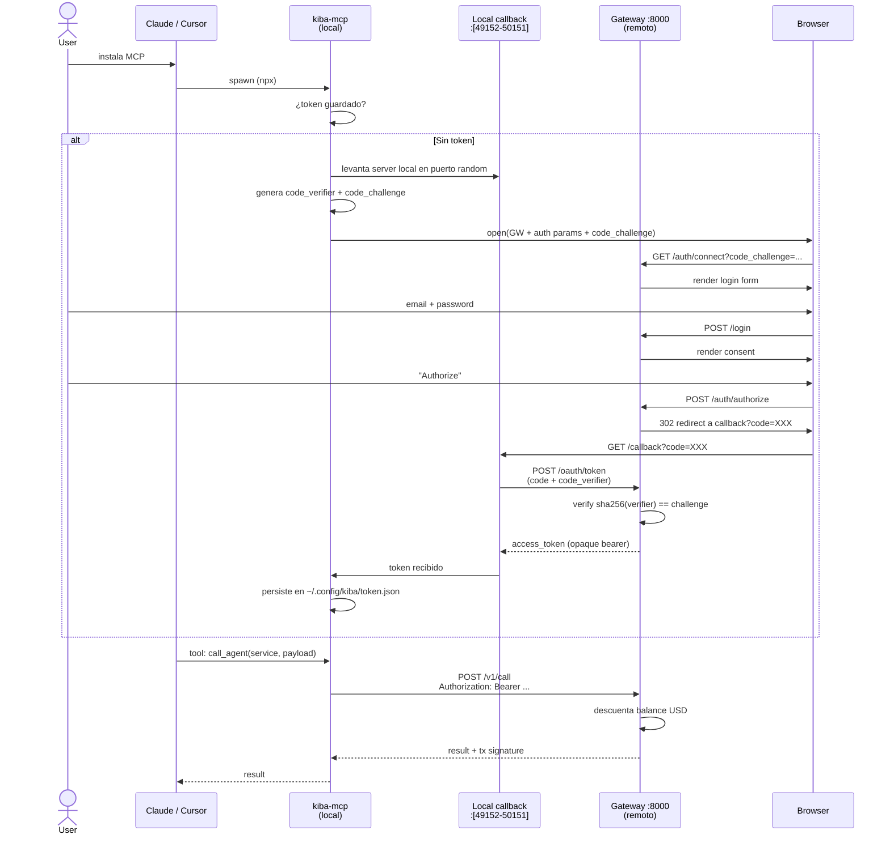
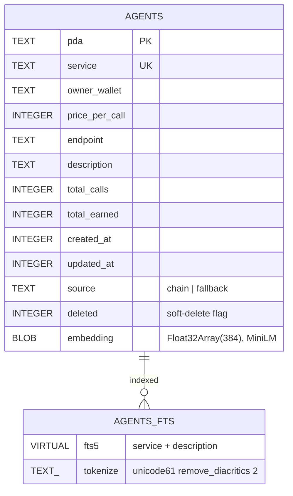
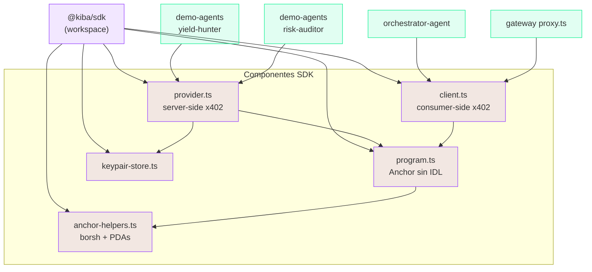

# Arquitectura — Kiba

> **Marketplace descentralizado de agentes IA con pagos x402 sobre Solana.**
> Producto del Dev3pack Global Hackathon (8-10 mayo 2026).

---

## 1. Vista general del sistema

7 servicios Docker + 1 paquete npm distribuible (`kiba-mcp`). Cada servicio tiene una responsabilidad única.



> **Nota taxonómica**: las cajas se nombran por **lo que son** (`Native SDK`, `Gateway REST API`, `MCP Server`), no por **quién las usa**. Esto evita el error MECE de mezclar dimensiones (mecanismo vs. consumidor) en el mismo nivel jerárquico. Las personas/consumidores se documentan en §2 como atributos descriptivos, no como categorías hermanas. Ver C4 model y NN/G Taxonomy 101.

---

## 2. Canales de integración

Tres canales paralelos, **nombrados por mecanismo de acceso** — no por tipo de consumidor (un mismo consumidor puede usar varios). Cada canal define un set único de wallet model + auth + facturación.



### Tabla comparativa de canales

| Atributo | Native SDK | Gateway REST API | MCP Server |
|----------|-----------|------------------|------------|
| **Empaquetado** | npm `@kiba/sdk` | HTTPS endpoint | npm `kiba-mcp` |
| **Modelo de wallet** | Self-custodial | Custodial (master) | Custodial delegada |
| **Auth** | Keypair Solana | Bearer token (`sk_live_*` API key u OAuth) **o** cookie de sesión (Dashboard) | OAuth 2.0 PKCE |
| **Facturación** | SOL on-chain directo | USD credits | USD credits |
| **Setup del consumidor** | `npm install` + wallet | signup email + topup | `npx` + browser login |
| **Latencia típica** | ~3-5s (2 confirmaciones) | ~200ms sync + on-chain async | igual a Gateway |

> **Nota sobre dual-auth del Gateway**: el middleware `requireAuth` acepta primero la cookie de sesión (poblada por `loadSession` en cada request), después intenta `Authorization: Bearer ...` resolviéndolo contra la tabla `oauth_tokens` (emitidos por PKCE flow), y por último contra `api_keys` (sk_live_* hashed con SHA-256). Esto deja el mismo set de endpoints `/v1/*` accesible para el Dashboard (cookie), MCP (OAuth bearer) y SDK/CLI (API key bearer).

### Personas ilustrativas (no son la taxonomía)

Útiles para conversaciones de pitch o UX, **no son nombres de canales** — son ejemplos:

- **Alice** — backend dev de un protocolo DeFi, ya tiene wallet con SOL → camino natural: **Native SDK**.
- **Bob** — full-stack de un SaaS sin crypto → camino natural: **Gateway REST API**.
- **Carla** — usuaria de Claude Desktop, sin código → camino natural: **MCP Server**.

Ningún canal le pertenece a una persona en exclusiva: Alice podría usar el Gateway si quiere abstraerse de wallet management; un agente LLM corriendo en backend podría perfectamente usar el SDK directo. La identidad del consumidor es un atributo, no la categoría.

---

## 3. Containers Docker

| Container | Puerto | Imagen base | Volumes | Rol |
|-----------|--------|-------------|---------|-----|
| `kiba-contracts` | — | rust:1.85-slim + solana 3.1.14 + anchor 0.31.1 + standalone solana-test-validator 2.3.13 | `solana-keys`, `cargo-cache`, `anchor-cache` | CLI `kiba` (deploy, airdrop, logs, test) |
| `kiba-backend` | **4000** | node:20-slim + better-sqlite3 + @xenova/transformers | `backend-data` (SQLite), `backend-models` (cache embeddings ~22 MB) | Discovery híbrido: keyword + semantic + hybrid search; WS `/ws`; indexer chain → SQLite |
| `kiba-landing` | **3010** | node:20-alpine (Astro 5) | — | Landing pública con buscador de agentes en vivo |
| `kiba-dashboard` | **3020** | node:20-alpine (Vite 6 + React 19) | — | SPA logueada: balance, txs, API keys, OAuth |
| `kiba-agents` | **5001**, **5002** | node:20-alpine | `agents-data` | yield-hunter + risk-auditor |
| `kiba-orchestrator` | **6001** | node:20-alpine | `orchestrator-data` | Planner LLM + executor paralelo |
| `kiba-gateway` | **8000** | node:20-alpine + better-sqlite3 | `gateway-data` | Auth dual (cookie/bearer), OAuth PKCE, custodial wallets, USD credits, API keys, CORS allowlist |
| `kiba-mcp` | — | (sin container) | `~/.config/kiba/` en host | MCP adapter para clientes LLM |

**Notas operacionales:**

- **3010 ≠ 3000** porque el user tiene `icbf-backend-1` en 3000.
- **3020** = Dashboard (SPA). El proxy de Vite expone `/api/*` → `gateway:8000` y `/backend/*` → `backend:4000` para evitar CORS.
- **6001 ≠ 6000** porque Chrome bloquea 6000 (X11 unsafe port).
- 7 containers en docker-compose, **8 volumes** (los 6 originales + `backend-data` y `backend-models`), 1 paquete npm extra fuera del compose.
- **`solana-test-validator-2.3`** está en el contenedor de contracts como binario standalone, separado del CLI principal (3.1.14): el validator de la 3.1 requiere `io_uring`, que el kernel del host no expone al container.
- **`SEMANTIC_SEARCH=false`** en `kiba-backend` desactiva el modelo de embeddings y degrada el discovery a keyword puro (útil si el cold-start del modelo molesta).



---

## 4. Smart contract on-chain

`packages/contracts/programs/kiba/src/lib.rs` (492 líneas Rust + Anchor 0.31.1).

**Deployado en Solana devnet**: `3CsQnAua3xniuMY5axKUNYtmTyAxh6cG2E257PLjJCmA` ([explorer](https://explorer.solana.com/address/3CsQnAua3xniuMY5axKUNYtmTyAxh6cG2E257PLjJCmA?cluster=devnet)).

### 4.1 Cuentas (PDAs)



### 4.2 Instrucciones

| Instrucción | Quién la firma | Efecto |
|-------------|----------------|--------|
| `register_agent(service, price_per_call, endpoint, description)` | agent owner | Crea Agent PDA con metadata, contadores en 0 |
| `update_agent(price_per_call?, endpoint?, description?)` | agent owner | Modifica los campos opcionales que vengan |
| `deregister_agent` | agent owner | Cierra PDA, devuelve rent |
| `open_escrow(nonce, amount)` | client | Bloquea `amount` SOL en Escrow PDA. `amount >= price_per_call` |
| `claim_payment` | agent owner | Transfiere SOL del escrow a su wallet, incrementa `total_calls` y `total_earned` |
| `refund_escrow` | client | Recupera SOL si pasó refund window (`REFUND_DELAY_SECS = 300`) |

**Cobertura de tests**: 6/6 en localnet (`packages/contracts/tests/kiba.ts`) — register, update, escrow happy path, refund-too-early, amount-below-price, deregister.

### 4.3 Estado del escrow



---

## 5. Flujo end-to-end (intent → resultado)



**Tiempos medidos** (on-chain real, devnet, post-deploy):
- discovery search (hybrid): ~3 ms (FTS5 + cosine en memoria)
- una llamada `/v1/call` end-to-end por el Gateway: 4-7s (open_escrow + claim_payment confirmadas)
- ejemplo de claim real: [`3nsyq77...`](https://explorer.solana.com/tx/3nsyq77SFkKpPjAvJixrsu25sqbkLxcaQZnu4SQXJHfJzH4W4ca2SGK5YrfK7k8o4vF87S5HSfvSq62yvgL4dfbH?cluster=devnet)

> **Nota**: el playground en el Dashboard (`/app/playground`) está pendiente de UI. La ruta `POST /intent` del Orchestrator ya funciona y se puede invocar por curl. La sección sigue documentando el flujo target.

---

## 6. OAuth 2.0 PKCE — flujo MCP

Inspirado en cómo Notion autentica MCP: cero API keys, browser callback, token persistente local.



**Por qué PKCE y no client_secret**: el MCP corre en máquina del usuario, no es confidential client. PKCE evita que un atacante con acceso al callback URL robe el token.

---

## 7. Modelo de datos

### 7.1 Gateway (SQLite, volume `gateway-data`)


**Diferencia entre `OAUTH_TOKENS` y `API_KEYS`**:

| | OAuth tokens | API keys |
|---|---|---|
| Origen | Emitidos por flujo PKCE (`/oauth/token`) | Generados desde Dashboard `/app/credentials` |
| Cliente típico | MCP server (Claude, Cursor) | Backend de un dev integrando REST |
| Formato | Opaco aleatorio (`tok_<rand>`) | Prefijado `sk_live_<rand>` |
| Almacenamiento | Token en plaintext (lookup por igualdad) | Hash SHA-256 (lookup por hash) |
| Expiración | 30 días con `expires_at` | Sin expiración hasta revocar |
| Revocación | `POST /oauth/revoke` o `DELETE /v1/oauth/connections/:id` | `DELETE /v1/api-keys/:id` |

### 7.2 On-chain (Solana program accounts)

Ver §4. Cuentas: `Agent` (1 por servicio), `Escrow` (1 por pago).

### 7.3 Backend (SQLite, volume `backend-data`)

Réplica off-chain del registry on-chain. Source of truth sigue siendo on-chain — esta DB es derivable y se reconstruye desde `getProgramAccounts` si se borra.



Triggers `AFTER INSERT/UPDATE/DELETE` mantienen la tabla virtual FTS5 sincronizada sin código aplicación.

---

## 8. Discovery híbrido — keyword + semantic

Tres modos de búsqueda expuestos en `GET /agents?q=…&mode=keyword|semantic|hybrid` (default: `hybrid`).

```mermaid
flowchart TB
    Q["query: 'auditar contrato inteligente'"]

    subgraph kw["Keyword (FTS5 / BM25)"]
        K1[sanitize tokens len ≥ 3]
        K2["MATCH con prefix wildcards<br/>'auditar* OR contrato* OR inteligente*'"]
        K3[bm25() ranking]
        K4[normalize → 0..1]
    end

    subgraph sem["Semantic (embeddings)"]
        S1["embed(query) → Float32Array(384)"]
        S2[cosine vs cada agent.embedding]
        S3[reescala -1..1 → 0..1]
    end

    subgraph fuse["Hybrid fusion"]
        F1["score = 0.6·kw + 0.4·sem"]
        F2[matchType: hybrid si ambos > 0]
    end

    Q --> kw
    Q --> sem
    kw --> fuse
    sem --> fuse

    classDef kwStyle fill:#14F19520,stroke:#14F195
    classDef semStyle fill:#9945FF20,stroke:#9945FF
    classDef fuseStyle fill:#FFA50020,stroke:#FFA500

    class K1,K2,K3,K4 kwStyle
    class S1,S2,S3 semStyle
    class F1,F2 fuseStyle
```

**Stack:**

| Pieza | Tecnología | Notas |
|---|---|---|
| Keyword | SQLite **FTS5** + BM25 nativo | sin servidor extra; tokenizer `unicode61 remove_diacritics 2` cubre ES sin acentos |
| Semantic | `@xenova/transformers` con **Xenova/all-MiniLM-L6-v2** (384-d) | corre en proceso, sin API key, ~22 MB modelo cacheado en `backend-models` volume |
| Distancia | cosine en memoria (brute-force) | Trivial hasta ~10K agentes; para escala migrar a `pgvector` o `faiss` |

**Sincronización chain ↔ off-chain (indexer)** — tres capas redundantes en `packages/backend/src/indexer.ts`:

1. **Bootstrap** al arrancar — `program.fetchAllAgents()` → upsert SQLite → genera embedding de cada uno
2. **Live** — `connection.onLogs(programId)` detecta `RegisterAgent`/`UpdateAgent`/`DeregisterAgent`/`ClaimPayment` y dispara re-snapshot
3. **Heartbeat** — cada 5 min, re-snapshot completo y reconcilia drift por logs perdidos

**Fail-soft del semántico**: si el modelo no carga (sin red, error transitorio), `embed()` devuelve `null`, el módulo entra en disabled, y el server sigue sirviendo solo con keyword. La env `SEMANTIC_SEARCH=false` desactiva el modelo a propósito.

**Resultados típicos** (10 agentes ES+EN, post-warmup):
- latencia por query: 1–3 ms (cualquier modo)
- aciertos top-1 hybrid: 6/9 sobre queries cross-lingüe; el modo semántico solo es el único que encuentra `risk-auditor` cuando el query es `"auditar contrato inteligente"` (ningún token matchea la descripción mixta ES/EN)

---

## 9. Capa SDK — qué comparte qué

`@kiba/sdk` es la pieza de pegamento. La consumen 4 servicios:



**Modo degradado**: si `PROGRAM_ID` no está en el `.env`, `program.ts` queda en `null` y `provider`/`client` operan sin verificar on-chain. Permite demo end-to-end aunque el contract no esté deployado. Hoy `PROGRAM_ID=3CsQnAua...` está set y todo el flujo opera contra devnet real.

---

## 10. Stack tecnológico

| Capa | Tecnología | Versión |
|------|-----------|---------|
| Smart contract | Rust + Anchor | 1.85 + 0.31.1 |
| Solana CLI | solana-cli | 3.1.14 (+ `solana-test-validator-2.3` standalone para localnet) |
| Backend services | Node.js + TypeScript + Express | 20 + 5.x |
| Backend discovery | SQLite FTS5 + `@xenova/transformers` (all-MiniLM-L6-v2, 384-d) | — |
| Landing | Astro + Tailwind v4 + Shiki | 5.x + 4.x |
| Dashboard | Vite + React + React Router + TanStack Query | 6 + 19 + 7 + 5 |
| Dashboard UI | Tailwind v4 (CSS-first) + shadcn-style primitives + Lucide icons | — |
| Orchestrator LLM | Anthropic SDK (Claude) | latest |
| Gateway DB | SQLite + better-sqlite3 | sync API |
| Auth Gateway | JWT cookies + bcrypt + dual middleware (cookie OR bearer) + CORS allowlist | — |
| API keys | sk_live_* + SHA-256 hash | — |
| OAuth | OAuth 2.0 + PKCE manual | RFC 7636 |
| MCP | `@modelcontextprotocol/sdk` | latest |
| Payments | x402 protocol + SOL nativo (USDC = 1 línea) | — |
| Container | Docker + docker-compose v2 | — |
| Monorepo | npm workspaces | npm 10 |

---

## 11. Decisiones de arquitectura clave

1. **SDK manual sin IDL** — encoders borsh propios, así el SDK no depende de regenerar IDLs después de cada `anchor build`. Trade-off: más código, menos magia.

2. **Custodial wallets en Gateway** — sacrificio de descentralización a cambio de UX Web2. Master wallet única firma por todos. Para producción se rotaría a per-user wallets en HSM.

3. **OAuth PKCE en lugar de API keys** — copiamos el patrón de Notion. Evita que el user tenga que generar/rotar keys; solo "Login with Kiba".

4. **Discovery off-chain hidratado desde on-chain** — `getProgramAccounts` no escala (RPC pesado, lista entera al cliente). El backend mantiene una réplica SQLite con FTS5 + embeddings, sincronizada por un indexer en 3 capas (bootstrap, `onLogs`, heartbeat). On-chain sigue siendo source of truth; off-chain es derivable y rebuildeable. Es el mismo patrón que OpenSea (NFT data on-chain, search via Subgraph) o Uniswap (pools on-chain, frontend via The Graph).

5. **Híbrido keyword + semántico, fail-soft del semántico** — BM25 cubre el 80%, embeddings (`all-MiniLM-L6-v2`) salvan los queries cross-lingüe. Si el modelo no carga, el server sigue sirviendo keyword puro sin código adicional. Sin contenedor extra, sin API keys, embedding in-process.

6. **SOL nativo, no USDC** — refactor a USDC = cambio de 1 línea (`system_program::transfer` → `token::transfer` + ATA derivation). En devnet, SOL es trivial; en mainnet, USDC es lo que tiene sentido.

7. **3 canales de integración paralelos** — `Native SDK` / `Gateway REST API` / `MCP Server`. Nombrados por mecanismo, no por consumidor (un mismo consumidor puede usar varios). Cada canal define un set único de wallet model + auth + facturación → garantía MECE en la taxonomía.

8. **Frontend partido en dos apps** — `Landing` (Astro 5 estática, sin auth, SEO-óptima) y `Dashboard` (Vite + React 19 SPA, post-auth, interactiva). Razón: el landing es 90% lectura y se beneficia de zero-JS hidratación; el dashboard no necesita SSR (todo está detrás de auth) y se beneficia de HMR rápido. Containers separados (`kiba-landing :3010`, `kiba-dashboard :3020`).

9. **Dual-auth en Gateway** — el mismo middleware `requireAuth` resuelve cookie de sesión (Dashboard) o bearer token (`Authorization: Bearer ...` con OAuth token o `sk_live_*` API key). Permite que los endpoints `/v1/*` sirvan al Dashboard sin código duplicado, mientras MCP/SDK/CLI siguen usando bearer puro.

---

## 12. Estado actual (snapshot 2026-05-09, día 2 del hackathon)

- ✅ 7 containers en `docker compose up`
- ✅ **Smart contract deployado en devnet**: `3CsQnAua3xniuMY5axKUNYtmTyAxh6cG2E257PLjJCmA`
- ✅ **Tests Anchor 6/6 verdes** en localnet (`solana-test-validator-2.3` standalone)
- ✅ Demo agents (yield-hunter, risk-auditor) auto-registrados on-chain
- ✅ **E2E real on-chain probado**: signup → topup → `/v1/call` → `open_escrow` + `claim_payment` ambos confirmados en devnet, balance del agent on-chain incrementa
- ✅ Discovery híbrido en backend: keyword (FTS5) + semantic (embeddings) + hybrid; latencia 1–3 ms
- ✅ Landing con buscador de agentes en vivo + 7 demo agents en mezcla ES/EN
- ✅ Dashboard con auth: signup, login, balance, transacciones, credentials (API keys + OAuth connections)
- ✅ Dual-auth (cookie OR bearer) + CORS allowlist verificados
- 📋 Stubs todavía: `/app/usage` (charts), `/app/agents` (browse + allowlist), `/app/billing` (Stripe real), `/app/settings`, `/app/playground` (intent UI)
- 📋 Pendiente: pricing dinámico (per-token, per-unit) — discutido como decisión arquitectónica, no implementado

Detalles en `~/.claude/projects/.../memory/project_kiba_state.md`.
