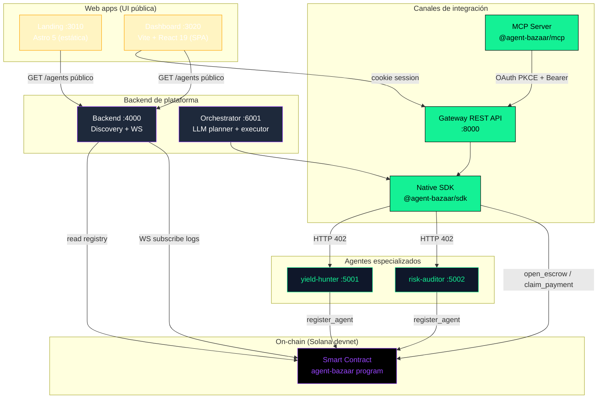
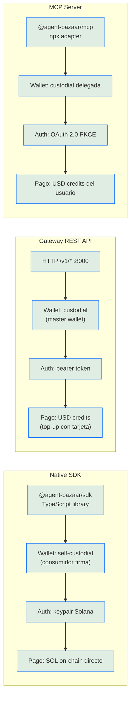
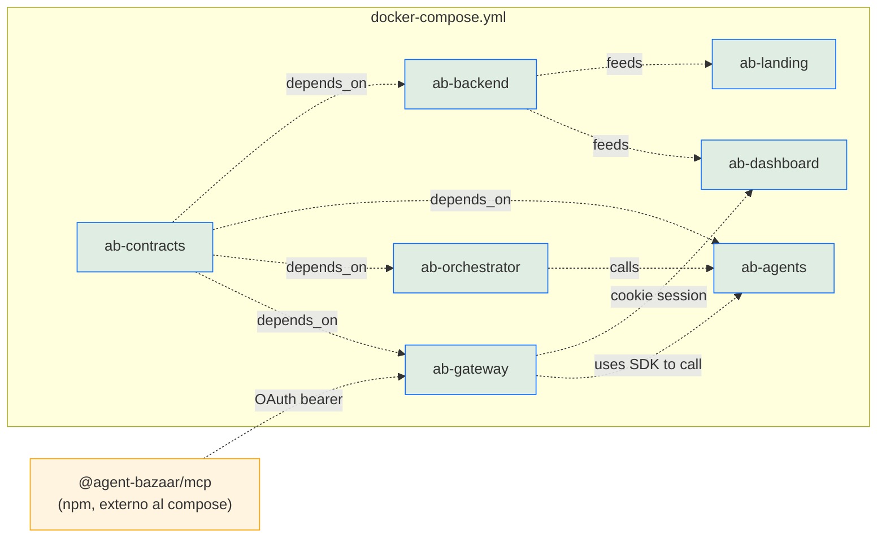
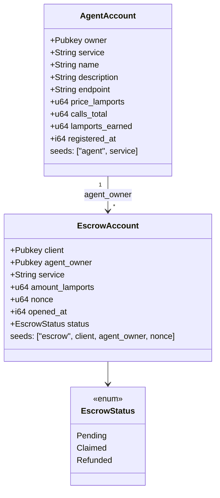
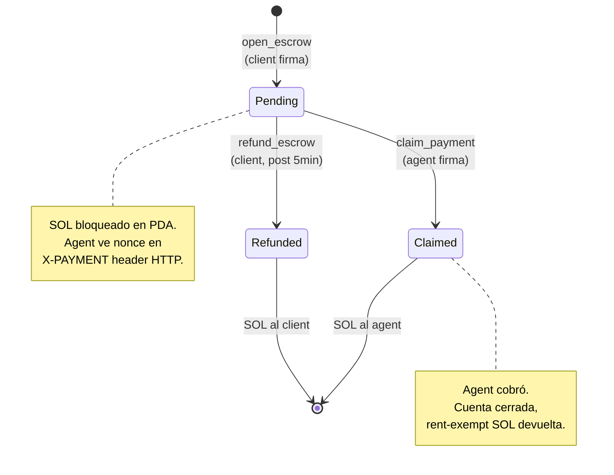
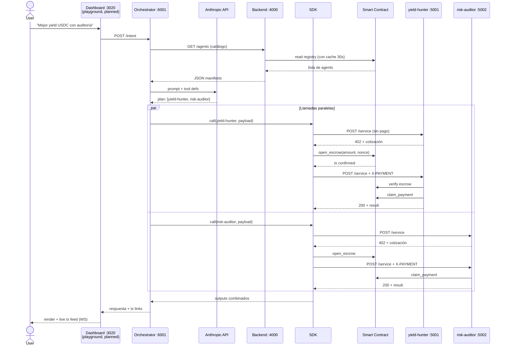
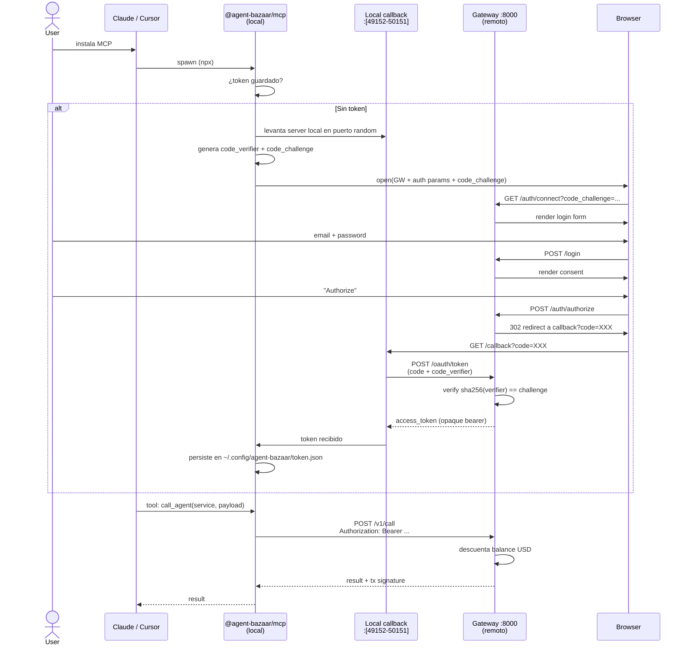
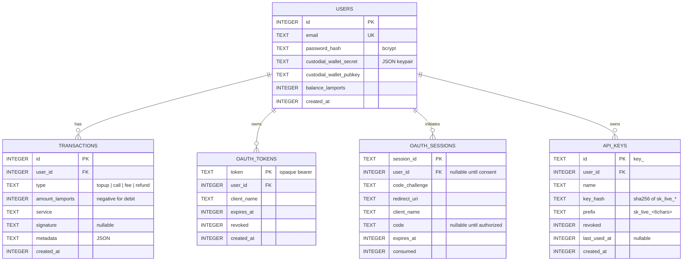
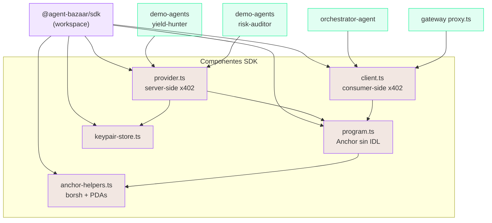

# Arquitectura — Agent Bazaar

> **Marketplace descentralizado de agentes IA con pagos x402 sobre Solana.**
> Producto del Dev3pack Global Hackathon (8-10 mayo 2026).

---

## 1. Vista general del sistema

7 servicios Docker + 1 paquete npm distribuible (`@agent-bazaar/mcp`). Cada servicio tiene una responsabilidad única.

> **Nota taxonómica**: las cajas se nombran por **lo que son** (`Native SDK`, `Gateway REST API`, `MCP Server`), no por **quién las usa**. Esto evita el error MECE de mezclar dimensiones (mecanismo vs. consumidor) en el mismo nivel jerárquico. Las personas/consumidores se documentan en §2 como atributos descriptivos, no como categorías hermanas. Ver C4 model y NN/G Taxonomy 101.

---

## 2. Canales de integración

Tres canales paralelos, **nombrados por mecanismo de acceso** — no por tipo de consumidor (un mismo consumidor puede usar varios). Cada canal define un set único de wallet model + auth + facturación.

### Tabla comparativa de canales

| Atributo | Native SDK | Gateway REST API | MCP Server |
|----------|-----------|------------------|------------|
| **Empaquetado** | npm `@agent-bazaar/sdk` | HTTPS endpoint | npm `@agent-bazaar/mcp` |
| **Modelo de wallet** | Self-custodial | Custodial (master) | Custodial delegada |
| **Auth** | Keypair Solana | Bearer token (`sk_live_*` API key u OAuth) **o** cookie de sesión (Dashboard) | OAuth 2.0 PKCE |
| **Facturación** | SOL on-chain directo | USD credits | USD credits |
| **Setup del consumidor** | `npm install` + wallet | signup email + topup | `npx` + browser login |
| **Latencia típica** | ~3-5s (2 confirmaciones) | ~200ms sync + on-chain async | igual a Gateway |

> **Nota sobre dual-auth del Gateway**: el middleware `requireAuth` acepta primero la cookie de sesión (poblada por `loadSession` en cada request), después intenta `Authorization: Bearer ...` resolviéndolo contra la tabla `oauth_tokens` (emitidos por PKCE flow), y por último contra `api_keys` (sk_live_* hashed con SHA-256). Esto deja el mismo set de endpoints `/v1/*` accesible para el Dashboard (cookie), MCP (OAuth bearer) y SDK/CLI (API key bearer).

### Personas ilustrativas (no son la taxonomía)

Útiles para conversaciones de pitch o UX, **no son nombres de canales** — son ejemplos:

- **Alice** — backend dev de un protocolo DeFi, ya tiene wallet con SOL → camino natural: **Native SDK**.
- **Bob** — full-stack de un SaaS sin crypto → camino natural: **Gateway REST API**.
- **Carla** — usuaria de Claude Desktop, sin código → camino natural: **MCP Server**.

Ningún canal le pertenece a una persona en exclusiva: Alice podría usar el Gateway si quiere abstraerse de wallet management; un agente LLM corriendo en backend podría perfectamente usar el SDK directo. La identidad del consumidor es un atributo, no la categoría.

---

## 3. Containers Docker

| Container | Puerto | Imagen base | Volumes | Rol |
|-----------|--------|-------------|---------|-----|
| `ab-contracts` | — | rust:1.79 + solana 1.18.22 + anchor 0.30.1 | `solana-keys`, `cargo-cache`, `anchor-cache` | CLI `bazaar` (deploy, airdrop, logs) |
| `ab-backend` | **4000** | node:20-alpine | — | Discovery: `GET /agents`, WS `/ws` |
| `ab-landing` | **3010** | node:20-alpine (Astro 5) | — | Landing page pública estática |
| `ab-dashboard` | **3020** | node:20-alpine (Vite 6 + React 19) | — | SPA logueada: balance, txs, API keys, OAuth |
| `ab-agents` | **5001**, **5002** | node:20-alpine | `agents-data` | yield-hunter + risk-auditor |
| `ab-orchestrator` | **6001** | node:20-alpine | `orchestrator-data` | Planner LLM + executor paralelo |
| `ab-gateway` | **8000** | node:20-alpine + better-sqlite3 | `gateway-data` | Auth dual (cookie/bearer), OAuth PKCE, custodial wallets, USD credits, API keys |
| `@agent-bazaar/mcp` | — | (sin container) | `~/.config/agent-bazaar/` en host | MCP adapter para clientes LLM |

**Notas operacionales:**

- **3010 ≠ 3000** porque el user tiene `icbf-backend-1` en 3000.
- **3020** = Dashboard (SPA). El proxy de Vite expone `/api/*` → `gateway:8000` y `/backend/*` → `backend:4000` para evitar CORS.
- **6001 ≠ 6000** porque Chrome bloquea 6000 (X11 unsafe port).
- 7 containers en docker-compose, 6 volumes, 1 paquete npm extra fuera del compose.

---

## 4. Smart contract on-chain

`packages/contracts/programs/agent-bazaar/src/lib.rs` (492 líneas Rust + Anchor 0.30.1).

### 4.1 Cuentas (PDAs)

### 4.2 Instrucciones

| Instrucción | Quién la firma | Efecto |
|-------------|----------------|--------|
| `register_agent(service, name, ...)` | agent owner | Crea AgentAccount PDA |
| `update_agent(...)` | agent owner | Modifica precio/desc/endpoint |
| `deregister_agent` | agent owner | Cierra PDA, devuelve rent |
| `open_escrow(amount, nonce)` | client | Bloquea `amount` SOL en EscrowAccount |
| `claim_payment` | agent owner | Transfiere SOL del escrow a su wallet |
| `refund_escrow` | client | Recupera SOL si pasó refund window (5 min) |

### 4.3 Estado del escrow

---

## 5. Flujo end-to-end (intent → resultado)

**Tiempos medidos** (camino degradado actual): ~242ms total. Con on-chain real: ~3-5s (2 confirmaciones).

> **Nota**: el playground en el Dashboard (`/app/playground`) está pendiente de UI. La ruta `POST /intent` del Orchestrator ya funciona y se puede invocar por curl. La sección sigue documentando el flujo target.

---

## 6. OAuth 2.0 PKCE — flujo MCP

Inspirado en cómo Notion autentica MCP: cero API keys, browser callback, token persistente local.

**Por qué PKCE y no client_secret**: el MCP corre en máquina del usuario, no es confidential client. PKCE evita que un atacante con acceso al callback URL robe el token.

---

## 7. Modelo de datos

### 7.1 Gateway (SQLite, volume `gateway-data`)

**Diferencia entre `OAUTH_TOKENS` y `API_KEYS`**:

| | OAuth tokens | API keys |
|---|---|---|
| Origen | Emitidos por flujo PKCE (`/oauth/token`) | Generados desde Dashboard `/app/credentials` |
| Cliente típico | MCP server (Claude, Cursor) | Backend de un dev integrando REST |
| Formato | Opaco aleatorio (`tok_<rand>`) | Prefijado `sk_live_<rand>` |
| Almacenamiento | Token en plaintext (lookup por igualdad) | Hash SHA-256 (lookup por hash) |
| Expiración | 30 días con `expires_at` | Sin expiración hasta revocar |
| Revocación | `POST /oauth/revoke` o `DELETE /v1/oauth/connections/:id` | `DELETE /v1/api-keys/:id` |

### 7.2 On-chain (Solana program accounts)

Ver §4. Cuentas: `AgentAccount` (1 por servicio), `EscrowAccount` (1 por pago).

---

## 8. Capa SDK — qué comparte qué

`@agent-bazaar/sdk` es la pieza de pegamento. La consumen 4 servicios:

**Modo degradado**: si `PROGRAM_ID` no está en el `.env`, `program.ts` queda en `null` y `provider`/`client` operan sin verificar on-chain. Permite demo end-to-end aunque el contract no esté deployado.

---

## 9. Stack tecnológico

| Capa | Tecnología | Versión |
|------|-----------|---------|
| Smart contract | Rust + Anchor | 1.79 + 0.30.1 |
| Solana CLI | solana-cli | 1.18.22 |
| Backend services | Node.js + TypeScript + Express | 20 + 5.x |
| Landing | Astro + Tailwind v4 + Shiki | 5.x + 4.x |
| Dashboard | Vite + React + React Router + TanStack Query | 6 + 19 + 7 + 5 |
| Dashboard UI | Tailwind v4 (CSS-first) + shadcn-style primitives + Lucide icons | — |
| Orchestrator LLM | Anthropic SDK (Claude) | latest |
| Gateway DB | SQLite + better-sqlite3 | sync API |
| Auth Gateway | JWT cookies + bcrypt + dual middleware (cookie OR bearer) | — |
| API keys | sk_live_* + SHA-256 hash | — |
| OAuth | OAuth 2.0 + PKCE manual | RFC 7636 |
| MCP | `@modelcontextprotocol/sdk` | latest |
| Payments | x402 protocol + SOL nativo (USDC = 1 línea) | — |
| Container | Docker + docker-compose v2 | — |
| Monorepo | npm workspaces | npm 10 |

---

## 10. Decisiones de arquitectura clave

1. **SDK manual sin IDL** — encoders borsh propios, así el SDK no depende de regenerar IDLs después de cada `anchor build`. Trade-off: más código, menos magia.

2. **Custodial wallets en Gateway** — sacrificio de descentralización a cambio de UX Web2. Master wallet única firma por todos. Para producción se rotaría a per-user wallets en HSM.

3. **OAuth PKCE en lugar de API keys** — copiamos el patrón de Notion. Evita que el user tenga que generar/rotar keys; solo "Login with Agent Bazaar".

4. **Modo degradado** — el sistema sirve una experiencia E2E sin contract deployado. Critical para demo si devnet faucet falla.

5. **SOL nativo, no USDC** — refactor a USDC = cambio de 1 línea (`system_program::transfer` → `token::transfer` + ATA derivation). En devnet, SOL es trivial; en mainnet, USDC es lo que tiene sentido.

6. **3 canales de integración paralelos** — `Native SDK` / `Gateway REST API` / `MCP Server`. Nombrados por mecanismo, no por consumidor (un mismo consumidor puede usar varios). Cada canal define un set único de wallet model + auth + facturación → garantía MECE en la taxonomía.

7. **Frontend partido en dos apps** — `Landing` (Astro 5 estática, sin auth, SEO-óptima) y `Dashboard` (Vite + React 19 SPA, post-auth, interactiva). Razón: el landing es 90% lectura y se beneficia de zero-JS hidratación; el dashboard no necesita SSR (todo está detrás de auth) y se beneficia de HMR rápido. Containers separados (`ab-landing :3010`, `ab-dashboard :3020`).

8. **Dual-auth en Gateway** — el mismo middleware `requireAuth` resuelve cookie de sesión (Dashboard) o bearer token (`Authorization: Bearer ...` con OAuth token o `sk_live_*` API key). Permite que los endpoints `/v1/*` sirvan al Dashboard sin código duplicado, mientras MCP/SDK/CLI siguen usando bearer puro.

---

## 11. Estado actual (snapshot 2026-05-09, día 2 del hackathon)

- ✅ 7 containers en `docker compose up` (contracts, backend, landing, dashboard, agents, orchestrator, gateway)
- ✅ Landing renderiza catálogo live del backend, code tabs con 3 canales, pricing
- ✅ Dashboard con auth funcional: signup, login, logout, balance, transacciones
- ✅ Credentials page funcional E2E: crear API key (sk_live_*), revocar OAuth connection
- ✅ Dual-auth verificado: la misma API key generada en UI funciona como Bearer en `curl /v1/me`
- ✅ Top-up vía REST descuenta y refleja en UI inmediatamente
- ✅ Probado E2E en modo degradado (~242ms intent → resultado, vía orchestrator)
- ⚠️ On-chain real bloqueado por devnet faucet rate-limit
- 📋 Pendiente para demo: SOL en operator wallet → `bazaar deploy` → activar PROGRAM_ID
- 📋 Stubs todavía: `/app/usage` (charts), `/app/agents` (browse + allowlist), `/app/billing` (Stripe), `/app/settings`, `/app/playground` (intent UI)

Detalles en `~/.claude/projects/.../memory/project_agent_bazaar_state.md`.
